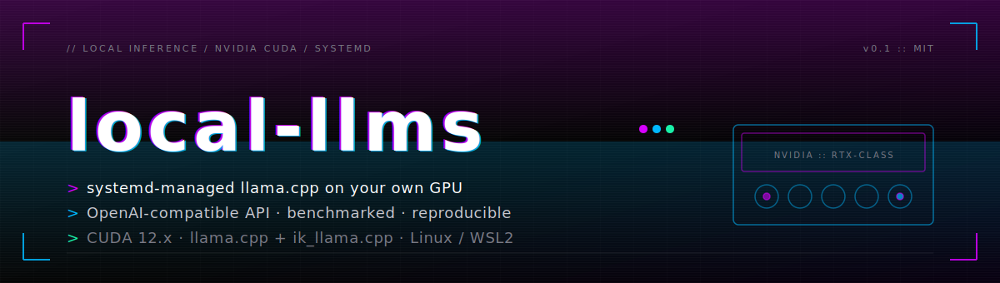
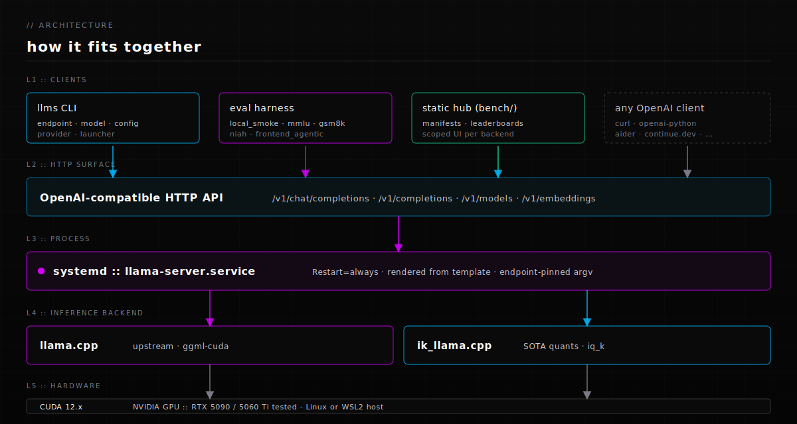

<p align="center">
  
</p>

<p align="center">
  
</p>

# local-llms

Run a local LLM as a persistent systemd service using [llama.cpp](https://github.com/ggerganov/llama.cpp), compiled from source with CUDA. Native Linux and WSL2. OpenAI-compatible API on top of an NVIDIA GPU. Includes a benchmark harness, a static report hub, and CLI tooling for endpoint lifecycle.

> **Hardware scope.** Targets NVIDIA CUDA on Linux or WSL2 with `systemd`. Shipped configs assume an RTX 5090 (32 GB VRAM) or a 5060 Ti fallback; smaller cards work but you will need to lower `context_length` and pick smaller quants. AMD / Apple / CPU-only setups are out of scope. Published benchmark numbers reflect the operator's own hardware — the hub is a showcase, not a public leaderboard.

## Quick start

```sh
git clone https://github.com/ajmeese7/local-llms.git
cd local-llms
./setup.sh
```

`setup.sh` checks prereqs, runs `uv sync --all-extras`, lints the YAML config tree, optionally builds the llama.cpp / ik_llama.cpp binaries, renders `config/llama-server.service.template` with the invoking user/group and repo path, installs the resulting unit to `/etc/systemd/system/llama-server.service`, and (re)starts the service. Nothing is machine-specific in the repo itself.

After the service is running:

```sh
.venv/bin/llms endpoint list                    # see what endpoints are defined
.venv/bin/llms model fetch <profile>            # pull missing model files from HF
.venv/bin/llms endpoint activate chat-default   # switch active endpoint, then systemctl restart
.venv/bin/llms eval run mmlu --endpoint chat-default --max-items 50
.venv/bin/llms eval report                      # refresh the hub registry
```

`endpoint activate` and `eval run` both check that the configured profile's `model_path` exists on disk; missing files trigger an interactive "download from Hugging Face?" prompt. Pass `--yes` to auto-accept, or pre-fetch with `llms model fetch <profile>` (useful for CI).

Want to bench the same model against a different backend? Pass `--provider` to `endpoint activate` (and to `eval run`, so the manifest records it) instead of authoring a new endpoint YAML:

```sh
.venv/bin/llms endpoint activate chat-carnice --provider ik_llama.cpp
sudo systemctl restart llama-server
.venv/bin/llms eval run frontend_agentic --endpoint chat-carnice --provider ik_llama.cpp
```

## How it fits together

<p align="center">
  
</p>

Everything talks to a single systemd-managed `llama-server` over the OpenAI-compatible HTTP API. The `llms` CLI, the eval harness, the static hub, and any third-party OpenAI client all share that surface, which keeps the swap between `llama.cpp` and `ik_llama.cpp` invisible to consumers.

## Configuration

The config tree is YAML under `config/`. Files are typed; `llms config lint` validates the whole tree.

| Directory | Kind | What it carries |
|---|---|---|
| `config/hardware/` | hardware | GPU detection regex, host/port floor, default endpoint |
| `config/providers/` | provider | inference backend (llama.cpp, ik_llama.cpp), capability flags |
| `config/profiles/` | profile | one model + decode params + provider compatibility |
| `config/endpoints/` | endpoint | binds a profile to a provider; this is what `llms endpoint activate` points at |

Precedence at runtime: endpoint overrides win, then profile, then hardware defaults. Capability mismatches (a profile asking for `kv_unified` against a provider that does not support it) raise at `config lint` rather than at launch.

## CLI

```sh
llms config lint                                  # validate the YAML tree
llms provider list                                # show inference backends + capabilities
llms provider install <name>                      # build a provider from source (e.g. ik_llama.cpp)
llms model status|fetch <profile>                 # report / download model files for a profile
llms endpoint list|status|activate|rollback|revisions|stats
  llms endpoint activate <name> --provider <p>    # pin a backend without authoring a new endpoint YAML
llms launcher render|exec                         # systemd entry, plus a dry-run printer
llms eval run <adapter> --endpoint <name>         # run a benchmark
  --provider <p>                                  # record/override the backend on the manifest
  --subset <category|csv-ids>                     # cap to one category or an explicit prompt list
  --skip-preflight                                # don't `GET /v1/models` before the run
  --max-consecutive-errors N                      # abort after N connect-class failures (default 1)
  --yes                                           # auto-accept the missing-model download prompt
llms eval list|show|report                        # browse runs, refresh the hub registry
```

Adapters shipping today: `local_smoke` (5-prompt keyword rubric), `mmlu`, `gsm8k`, `niah`, `frontend_agentic` (17-prompt front-end + agentic suite — see [`docs/FRONTEND_AGENTIC_EVAL.md`](docs/FRONTEND_AGENTIC_EVAL.md)). Deferred adapters and other follow-ups are tracked in [`docs/ROADMAP.md`](docs/ROADMAP.md).

## Documentation

| Guide | Purpose |
|---|---|
| [docs/SETUP.md](docs/SETUP.md) | Prereqs, CUDA toolkit notes, manual setup |
| [docs/CONFIGURATION.md](docs/CONFIGURATION.md) | YAML config tree, merge precedence, capability checks |
| [docs/USAGE.md](docs/USAGE.md) | API examples, useful commands |
| [docs/MODELS.md](docs/MODELS.md) | Model recommendations and notes |
| [docs/BENCHMARKING.md](docs/BENCHMARKING.md) | Eval adapters, run manifests, the report hub |
| [docs/WSL2.md](docs/WSL2.md) | Networking, auto-start, keep-alive |
| [docs/TROUBLESHOOTING.md](docs/TROUBLESHOOTING.md) | CUDA, OOM, service startup, build failures |
| [docs/ROADMAP.md](docs/ROADMAP.md) | What is left |

Reading order by goal:

- **Bring up a new machine**: [SETUP](docs/SETUP.md) → [CONFIGURATION](docs/CONFIGURATION.md) → [USAGE](docs/USAGE.md)
- **Experiment with local models**: [MODELS](docs/MODELS.md) → [BENCHMARKING](docs/BENCHMARKING.md)
- **WSL-specific setup**: [SETUP](docs/SETUP.md) → [WSL2](docs/WSL2.md) → [TROUBLESHOOTING](docs/TROUBLESHOOTING.md)

## Hub

The static SPA at `bench/` reads runs from `bench/reports/`. It is meant to be published; see [`bench/README.md`](bench/README.md).

```sh
cd bench && python3 -m http.server 5173
```
